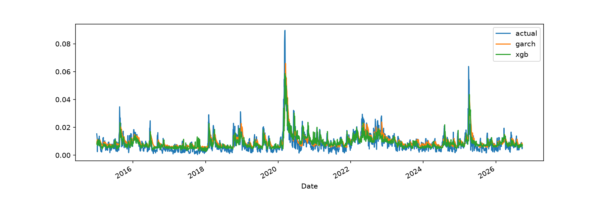

# Volatility Forecasting on SPY: ML Models vs GARCH

Forecasting 5-day realized volatility of SPY with linear regression, random forest, and XGBoost, benchmarked against a GARCH(1,1) model and a naive persistence baseline using walk-forward validation.

## Key findings

- With price-based features only, no model clearly beat GARCH(1,1) (RMSE 0.00544 vs 0.00556 for the best ML model).
- Adding VIX-derived features cut RMSE by roughly 9–14% across the ML models. All three then beat GARCH by about 7% and the naive baseline by about 18%.
- The three ML models performed almost identically with VIX (RMSE 0.00506–0.00507). An ablation showed that a linear model using only `rv5` and `vix` matches the full feature set, so the information in VIX mattered far more than model choice.

## Approach

- **Data:** daily SPY prices and the VIX index from Yahoo Finance (`yfinance`), 2005 to present.
- **Target:** standard deviation of daily log returns over the next 5 trading days.
- **Features** (all known at the close of day *t*):
  - Trailing realized volatility over 5, 10, and 20 days
  - Absolute daily return and daily change in trading volume
  - VIX level (converted to a daily volatility scale) and its daily change
- **Models:** linear regression, random forest, XGBoost, plus GARCH(1,1) and a naive baseline that predicts the trailing 5-day volatility.
- **Validation:** walk-forward. The test period starts in 2015 and moves forward in 63-trading-day (about one quarter) blocks. Each model is retrained before every block using only earlier data, and the last 5 training rows are dropped because their targets overlap the test block. GARCH is refit on the same schedule.
- **Metrics:** RMSE and MAE (lower is better).

## Results

Out-of-sample, 2015 to October 2026:

| Model | RMSE | MAE |
|---|---|---|
| Naive (trailing 5-day vol) | 0.00616 | 0.00402 |
| GARCH(1,1) | 0.00544 | 0.00366 |
| Linear regression (with VIX) | 0.00507 | 0.00321 |
| Random forest (with VIX) | 0.00507 | 0.00332 |
| XGBoost (with VIX) | 0.00506 | 0.00329 |

Before adding VIX features:

| Model | RMSE | MAE |
|---|---|---|
| Linear regression | 0.00556 | 0.00352 |
| Random forest | 0.00584 | 0.00374 |
| XGBoost | 0.00589 | 0.00368 |

Naive and GARCH do not use these features, so their numbers are the same in both runs.



**What the plot shows:** Forecasts track the overall level of volatility well, but both GARCH and XGBoost under-predict the sharpest spikes (about 0.09 actual vs roughly 0.055–0.065 forecast in early 2020, and a similar gap in 2025), with XGBoost undershooting more than GARCH. In calm periods the forecasts are smoother than realized volatility.

### Ablation: how much comes from VIX?

Linear regression with fewer features:

| Features | RMSE | MAE |
|---|---|---|
| `rv5` only | 0.00559 | 0.00366 |
| `rv5` + `vix` | 0.00507 | 0.00317 |
| All price features, no VIX | 0.00556 | 0.00352 |
| All features + VIX | 0.00507 | 0.00321 |

**Takeaway:** `rv5` and `vix` alone match the full feature set (RMSE 0.00507), while `rv5` alone performs like the full price-only model (0.00559 vs 0.00556). VIX accounts for essentially all of the gain, and the extra price features and nonlinear models add little on top of it.

## Limitations

- The ML models see VIX and GARCH does not, so the comparison is not like-for-like. VIX is itself a forward-looking volatility estimate from the options market, so the result is "price features plus VIX beat GARCH," not "ML beats GARCH."
- Consecutive 5-day targets overlap, so errors are correlated. Small gaps (for example 0.00506 vs 0.00507) are not statistically meaningful, and I have not run significance tests.
- Single asset, single time period, and default or lightly chosen hyperparameters with no tuning.
- Results change slightly as new data is downloaded, since the script pulls the latest prices.

## How to run

```bash
python3 -m venv .venv
source .venv/bin/activate
pip install yfinance pandas numpy scikit-learn xgboost arch matplotlib
python vol_model.py
```

On macOS, XGBoost also needs OpenMP: `brew install libomp`.

## Files

- `vol_model.py`: full pipeline (data, features, models, walk-forward evaluation, plots, ablation)
- `results_baseline.txt`, `results_vix.txt`, `results_ablation.txt`: saved output from each experiment
- `forecast_plot.png`: forecasts vs actual volatility

## Possible next steps

- Predict log volatility to reduce the influence of spikes
- Test other horizons (1-day, 21-day) and longer-window features
- Add a news-sentiment feature
- Significance tests for model comparisons